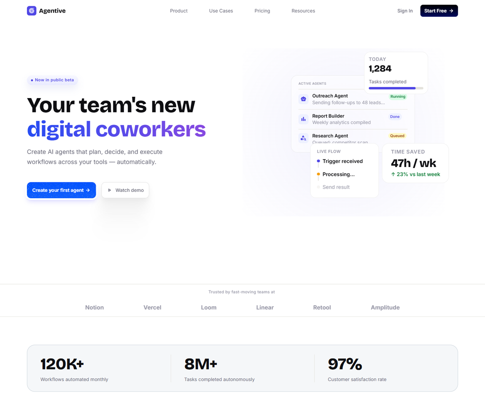
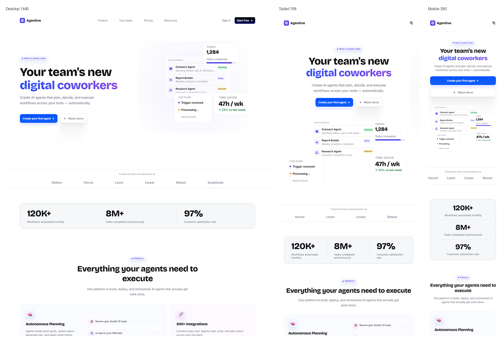
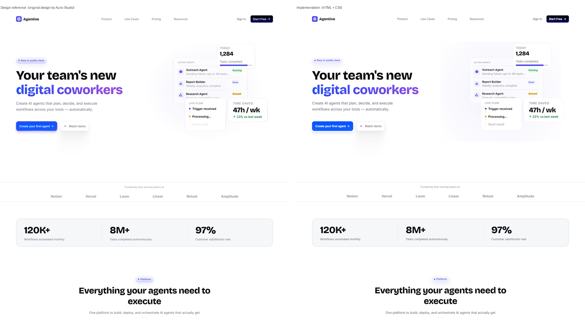
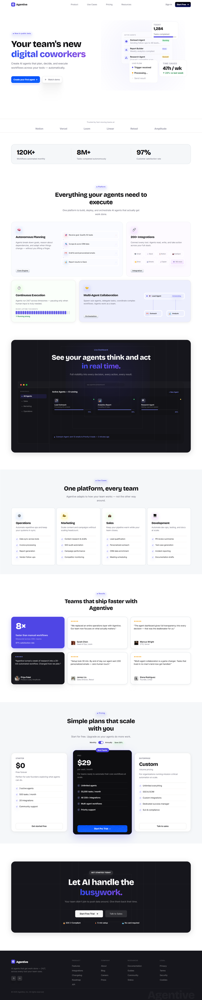

# Agentive — AI SaaS Landing Page (Figma → Responsive HTML/CSS)

A high-fidelity, fully responsive implementation of the **Agentive** AI SaaS landing page design, built with plain HTML5 + CSS3 and self-hosted fonts.

**🔗 Live:** https://jackz0526.github.io/agentive-saas-landing/



---

## Responsive — one page, three breakpoints

Desktop 1440 · Tablet 768 · Mobile 390 — no framework, no page builder.



---

## Fidelity

Average pixel difference against the Figma reference render:

| Breakpoint | Avg. pixel difference | Pixels differing > 24/255 |
|---|---|---|
| Desktop 1440 | **2.28 / 255** | 1.73 % |
| Tablet 768 | **3.03 / 255** | 2.44 % |
| Mobile 390 | **3.57 / 255** | 3.19 % |

Flat areas without text reach ≈ **1.0 / 255**. The remaining difference is dominated by **text rasterisation** — browser anti-aliasing and hinting differ from the design tool's own renderer, which is not eliminable in an HTML/CSS reproduction.

### Design reference vs. implementation

Left: the original Figma render. Right: the HTML/CSS implementation, same width, same height.



<details>
<summary>Full-page view (desktop)</summary>



</details>

---

## Markup, accessibility & interactivity

The page is semantic HTML5 — not flat positioned boxes:

- **Landmarks** — `header`, `nav`, `main`, `section` (9 per breakpoint, each with an `id`) and `footer`, with an `h1` / `h2` / `h3` heading hierarchy.
- **Real controls** — navigation items and calls to action are actual `<a href>` links (**68**) and `<button type="button">` elements (**52**), with `aria-label`s where the visible label isn't enough.
- **Interaction states** — a hover state on links/buttons and a visible keyboard `:focus-visible` outline; every interactive element is reachable by Tab.
- **Images** — descriptive `alt` text on all icon assets (67/67) and on content images; purely decorative texture layers use an empty `alt`.

---

## Structure

```
index.html    semantic markup for all three breakpoints
styles.css    scoped per-element styles + interaction states
assets/       images
graphics/     vector icons (SVG) and raster assets
fonts/        self-hosted webfonts (Inter, Bricolage Grotesque)
docs/         preview images used in this README
```

---

## Design credit

The visual design is **not mine**. The original Figma mockup,
*“Agentive — Free AI SaaS Landing Page Figma Template (Desktop + Tablet + Mobile)”*,
is by **Auric Studio** (published on the Figma Community).

The code implementation in this repository was produced for this build.
